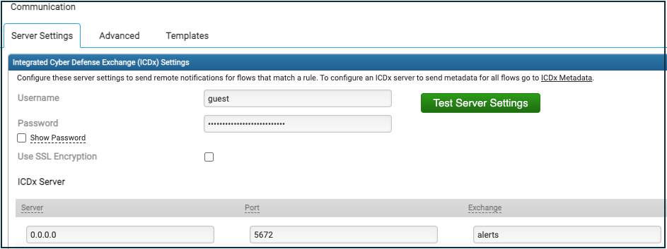
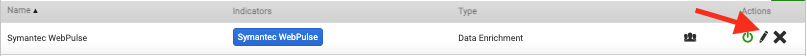
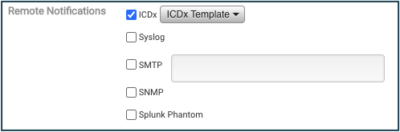
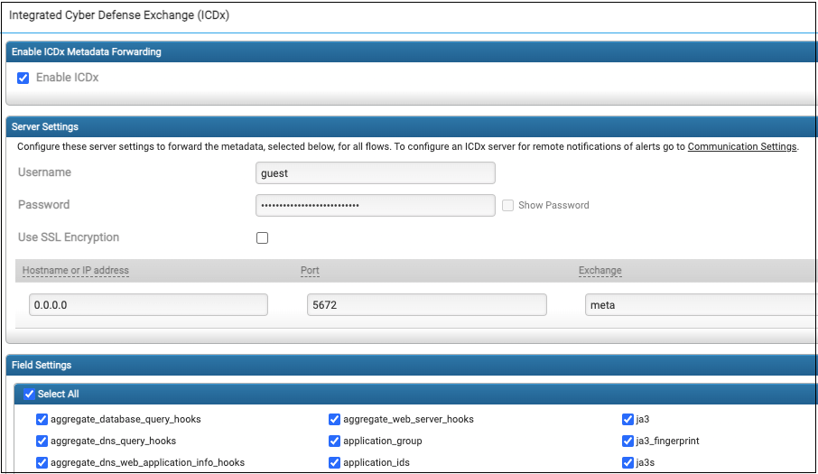
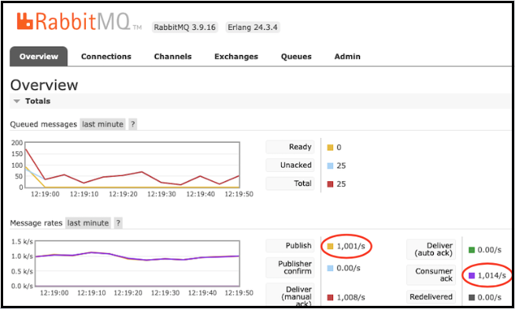

# Security Analytics Export for Splunk

This project provides sample code and instructions to export Security Analytics sensor alerts and session metadata to Splunk.

## Overview

Security Analytics (SA) 8.2.4 sensors support high-performance export of alert and session metadata to Broadcom’s Integrated Cyber Defense Exchange (ICDx). This export feature can be used to export data to Splunk Enterprise or potentially any other SIEM.

This project provides the code and instructions to export data from SA sensors to Splunk Enterprise using some python code and the open-source RabbitMQ message broker. We also include Go code but it isn't covered in this release of the documentation. You can implement these solutions as-is or customize it for your environment or even another SIEM.

The python solution can forward metadata for over 100,000 SA sessions per second in our lab on a Dell R630 (2 Intel Xeon E5-2620 CPUs and 128GB RAM). YMMV.

This solution includes three order-dependent steps:
1. Launch a RabbitMQ service.
2. Launch one or more consumer processes that configure and subscribe to the RabbitMQ service and then forward all received events to Splunk.
3. Configure SA sensors to send alerts and/or session metadata to the RabbitMQ service.

### Prerequisites

- A Linux server or VM to host the RabbitMQ service and consumer(s), with the following installed:
    - Docker
    - Python 3.8 or above
    - the Python requests library (pip3 install requests)
    - the Python pika library (pip3 install pika). pika is a Python implementation of the AMQP 0-9-1 protocol which is used to communicate with the RabbitMQ service, and requires Python 3.4+.
- A Splunk Enterprise installation with an HTTP Event Collector (HEC) configuration and associated access token.
- One or more SA sensors running v8.2.4 or higher.


### Related Documentation
- [Docker Hub RabbitMQ home](https://hub.docker.com/r/airdock/rabbitmq)
- [RabbitMQ Documentation home](https://www.rabbitmq.com/documentation.html)
- [RabbitMQ Access Control documentation](https://www.rabbitmq.com/access-control.html)
- [RabbitMQ Monitoring documentation](https://www.rabbitmq.com/monitoring.html)
- [Splunk HEC setup documentation](https://docs.splunk.com/Documentation/Splunk/8.2.6/Data/UsetheHTTPEventCollector)

## Setup Instructions

>**Note**: These instructions rely on the default configuration. See *Customizing Your Configuration* and *Performance Optimizations* below for configuration tips.

### STEP 1: Launch the RabbitMQ Service

On the system that will host the RabbitMQ service:

1. Confirm the system meets the prerequisites listed above.

2. Launch the Docker RabbitMQ container:

```sh
docker run -it --rm --name rabbitmq -p 5672:5672 -p 15672:15672 --hostname sa-meta-export rabbitmq:3.9-management
```
Add the -d argument if you want to run as a daemon.

The RabbitMQ service listens on two ports and is now ready for configuration by consumer.py:

- Port **5672** for inbound SA alerts and metadata.
- Port **15672** for RabbitMQ’s HTTP management console

    > For more information, see [Docker Hub RabbitMQ home](https://hub.docker.com/r/airdock/rabbitmq).

3. Verify RabbitMQ availability by browsing to the Web console and logging in with the default username 'guest' and password 'guest':

```sh
http://<RabbitMQ host IP>:15672/
```

### Step 2: Launch One or More Consumers

By default, one or more consumers run alongside RabbitMQ and perform two tasks: (1) they initially configure the RabbitMQ virtual host, exchange, and queues for communication with one or more SA sensors, then (2) they begin forwarding all SA sensor messages to Splunk. The initial RabbitMQ configuration is idempotent and may be run multiple times without consequence as you stop and start a consumer.

Each consumer can forward messages from only one RabbitMQ exchange (i.e. alerts or meta). So, if you want to forward both alerts and session metadata, you'll have to launch a consumer for each exchange in separate sessions. In *Performance Tuning* below, we discuss launching multiple consumers for a single exchange.

1. Browse to https://github.com/Broadcom/security-analytics-export-tools

    On the system that is hosting the RabbitMQ service (localhost):


2. If you have git installed, you can clone the repository. If not, use these instructions to download the code:

    a. Click the green github repo UI’s Code dropdown menu and select ‘Download ZIP’ to download the file.

    b. Find the downloaded file (security-analytics-export-tools.zip).

    c. Run the following:

```sh
unzip -d <your desired parent directory> security-analytics-export-tools.zip

cd <parent directory>/security-analytics-export-tools
```
3. Use an editor to configure both alerts.ini and/or meta.ini with your Splunk URL and access token.
		
4. (Optional) Launch a consumer for the 'alert' exchange:

```sh
python3 python/consumer.py --config config/alerts.ini
```

5. (Optional) Launch a consumer for the 'meta' exchange:

```sh
python3 python/consumer.py --config config/meta.ini
```

The consumers are now waiting for messages from RabbitMQ.

### STEP: 3: Configure SA for Export

> **Note:** SA sensors cannot be configured for export until after the consumer process or processes have performed their initial configuration of RabbitMQ. 

> **Important:** Although you’re not using Broadcom’s ICDx exchange, you’ll be using SA’s ICDx menu options to configure SA export to your RabbitMQ service. Wherever you see a reference to "ICDx", think “RabbitMQ”.

SA alert and session metadata export configuration use two separate UIs:

- Steps to Enable SA Alert Export
- Steps to Enable SA Metadata Export

**Steps to Enable SA Alert Export**

1. Use the SA main menu > Settings > Communication > “Integrated Cyber Defense Exchange (ICDx) Settings” UI to configure alert export to the RabbitMQ service.



2. Set the Username to “guest” (default).


3. Set the Password to “guest” (default).


4. Uncheck “Use SSL Encryption” since it’s beyond the scope of this solution.


5. Set the Server to the IP address or DNS name where the RabbitMQ service is running.


6. Leave the Port set to “5672” (default).


7. Set the Exchange to “alerts”.


8. Click the “Test Server Settings” to confirm a valid connection.


9. Click “Save” at the bottom of the page.


10. On the main menu, go to Analyze > Rules


11. Click the pen icon to edit the rule for which you want to export alerts. You may configure export on as many rules as you like.



12. On the Edit Rule UI select the Remote Notifications > ICDx checkbox.



13. Click Save.

**Congratulations!** At this point, you should begin to see all of your ICDx-enabled alerts exported individually in real-time as your configured rule fires on incoming traffic. Session metadata export is handled differently below.

Optionally, you may use the main menu > Settings > Communication > Templates > New UI to create a custom ICDx alert export template with additional metadata attributes.


**Steps to Enable SA Metadata Export**

1. Use the SA main menu > Settings > ICDx Metadata UI to configure metadata export to the RabbitMQ service.



2. Click the “Enable ICDx” checkbox.


3. Set the Username to “guest” (default).


4. Set the Password to “guest” (default).


5. Uncheck “Use SSL Encryption” since it’s beyond the scope of this Application Note.


6. Set the Server to the IP address or DNS name where the RabbitMQ service is running.


7. Leave the Port set to “5672” (default).


8. Set the Exchange to “meta”.


9. Select your desired metadata attributes for export.

    The grayed out attributes are exported by default.

    ICDx Metadata attributes are available for export only if enabled in the Settings > Metadata UI.


    > **Note:** We recommend you minimize your selections to limit end-to-end processing and bandwidth load.

10. Click the “Test Server Settings” at the bottom of the page to confirm a valid connection.


11. Click “Save”.

**Congratulations!** At this point, you should begin to see all of your metadata exported in batches of 100 as the sensor captures traffic. Until 100 sessions have been captured, no data will be exported. This is different from alert export where alerts are exported individually as the rules are triggered. 

## Customizing Your Configuration
You are welcome to modify the Python and Go code for your needs, including plumbing for another SIEM.

If you want to change the configuration, these documents will prove helpful:

- [Docker Hub RabbitMQ home](https://hub.docker.com/r/airdock/rabbitmq)
- [RabbitMQ Documentation home](https://www.rabbitmq.com/documentation.html)
- [RabbitMQ Access Control documentation](https://www.rabbitmq.com/access-control.html)

If you change your configuration, be sure to coordinate the settings in these locations:

- docker run command
- alerts.ini
- meta.ini
- SA UI alert export configuration
- SA UI meta export configuration

## Performance Tuning
On a single sensor, alert forwarding should be limited to potentially actionable events. So, it’s a much lighter workload than that of session metadata where you’re forwarding a JSON metadata record for every traffic session. However, once you begin to aggregate those workloads from many sensors, even the alert forwarding can be significant.

Your forwarding performance depends on the following factors, discussed below.
- Alert JSON weight
- SA session metadata field selection
- Your forwarding workload
- RabbitMQ platform hardware and availability
- RabbitMQ configuration
- Consumer configuration.
- Network speeds and congestion
- Splunk availability


### Alert JSON Weight

You can see an example of the default JSON data sent for each alert event below, in Sample Export Data.   

Optionally, you may use the SA main menu > Settings > Communication > Templates > New UI to create a custom ICDx alert export template to change the exported metadata fields if desired.

### Session Metadata JSON Weight

By default, the session metadata record includes the following required fields: flow_id (session_id), initiator_ip, initiator_port, responder_ip, responder_port, start_time, stop_time. This is a fairly lightweight record. See an example in Sample Export Data.

You may add more or even all of the available fields based on your needs, but be aware that the record weight grows with each field (some more than others), and increases the overall forwarding workload as you aggregate metadata from many sensors.

Consider trimming all unnecessary fields. 

### Your Forwarding Workload

If you haven’t already, it’s a good idea to estimate your alert rate using the Analysis > Alerts dashboard and your session rate with the Analysis > Summary > Sessions UI. That way you know what to expect when you fire everything up.


### RabbitMQ Platform Hardware and Availability

For lighter workloads you can run the RabbitMQ service and consumer(s) on a shared system without too much concern for resources. But heavier workloads, above 25,000 messages/second will require more, even consuming a dedicated server at higher levels. 

Our dedicated RabbitMQ/consumer Dell R630 (2 Intel Xeon E5-2620 CPUs and 128GB RAM) mentioned in the Overview was running at ~85% CPU utilization with a thread count of 20 when forwarding over 100,000 sessions/second.

### RabbitMQ Configuration

We didn’t explore any RabbitMQ configuration tuning options so our lab system was running with the default Docker configuration.

If a single RabbitMQ instance is insufficient, for example when aggregating metadata from many sensors, you can launch multiple instances on separate systems and have different sensors talk to different RabbitMQ services. However, based on our testing the RabbitMQ service is very efficient and wasn’t ever the bottleneck.

### Consumer Configuration

Both the meta.ini and alerts.ini configuration files contain a ‘threads’ option you should experiment with. For lighter workloads, you can tune those thread counts down into the 2-4 range. For higher workloads we’ve seen performance improvements with up to 20 threads but didn’t see much difference with more, even above 100,000 messages/second. YMMV.

Too many threads may overwhelm the machine where the consumer is running or the Splunk service, since each thread will create a new connection to the Splunk service. Don’t set the threads value higher than approximately half the number of available cores, to ensure there are enough cores for running the RabbitMQ service.

If a single consumer instance is insufficient, even with a high thread count, you can launch multiple consumer instances on separate machines.  The RabbitMQ service will send new data to each consumer in a round-robin fashion. Keep in mind that Splunk ingestion may become the limiting factor.
### Network Speeds and Congestion

This can always be a factor.
### Splunk Availability

Your Splunk implementation’s ingestion capacity can become a bottleneck, especially if you choose to forward higher volumes of messages.

## Monitoring
Here are three ways to monitor your forwarding process:

- Via SA 
- Via RabbitMQ
- Via consumer.py

### Via SA

**View SA’s alert export statistics**

The SA offbox process reports alerts sent to RabbitMQ every 5 minutes in /var/log/messages. In this case, 3 alerts were triggered, received by offbox, and sent to RabbitMQ. 

```sh
offboxd[12542]: [3/3] ICDx delta received/sent
```
You may also run `offbox --print` on the sensor while you're running `tail -f /var/log/messages` in another session to receive this output:

```sh
2022-05-20T11:05:43-06:00 104 offboxd[12573]: =+=+=+=+=+=+=+= Stats Starts =+=+=+=+=+=+=+=
2022-05-20T11:05:43-06:00 104 offboxd[12573]: [180230] Received
2022-05-20T11:05:43-06:00 104 offboxd[12573]: [180230] Sent
2022-05-20T11:05:43-06:00 104 offboxd[12573]: [0] Purged
2022-05-20T11:05:43-06:00 104 offboxd[12573]: [0] Dropped
2022-05-20T11:05:43-06:00 104 offboxd[12573]: [0] Events in queue
2022-05-20T11:05:43-06:00 104 offboxd[12573]: [1/1] ICDx delta received/sent
2022-05-20T11:05:43-06:00 104 offboxd[12573]: [180230/33709] ICDx total received/sent
2022-05-20T11:05:43-06:00 104 offboxd[12573]: [0] SMTP received
2022-05-20T11:05:43-06:00 104 offboxd[12573]: [0] SNMP received
2022-05-20T11:05:43-06:00 104 offboxd[12573]: [0] Phantom cyber received
2022-05-20T11:05:43-06:00 104 offboxd[12573]: [0] syslog received
2022-05-20T11:05:43-06:00 104 offboxd[12573]: [14] Actions loaded
2022-05-20T11:05:43-06:00 104 offboxd[12573]: =+=+=+=+=+=+=+=  Stats Ends  =+=+=+=+=+=+=+=
```

Use the SA main menu > Analyze > Alerts > Dashboard UI to view your alert history. Use the Time Range filter to focus on the 5 minutes prior to the offbox log message, above, to verify the three alerts and the rules that generated them.

SA will only export those alerts associated with rules configured to export to ICDx. See Steps to Enable SA Alert Export.


**View SA’s metadata export statistics**

The SA shaft process reports its statistics to /var/log/messages every 10 minutes, including ICDx export stats.

```sh
shaft[12334]: (sa.core.shaft.stats) Shaft stats flows exported: Flows(total/delta/active): 5471175116/415903/0, Dropped(t/d): 0/0, ICDx(t/d): 156685906/415903, CSV(t/d): 0/0
```
The ICDx(t/d) statistics include total (t) flows (i.e. session metadata) sent since the shaft process launched and the delta (d) flows sent during the last 10 minutes. 

### Via RabbitMQ

See the RabbitMQ Monitoring documentation for a complete overview of built-in and external monitoring options.

- [RabbitMQ Monitoring documentation](https://www.rabbitmq.com/monitoring.html)

Log into the RabbitMQ web console using your IP address or DNS name:

```sh
http://<RabbitMQ host IP>:15672/
```

The web console provides several helpful views, including an overview and a queue view.



### Via consumer.py

consumer.py provides three output configurations, configurable via the alerts.ini and meta.ini files:

**Default** - display statistics every 5 seconds if it is receiving data:

```sh
[python] Exchange: meta, Total Messages: 4150, Messages/Second: 222.0, Sessions/Second: 22200

[python] Exchange: meta, Total Messages: 5197, Messages/Second: 209.4, Sessions/Second: 20940

[python] Exchange: meta, Total Messages: 6326, Messages/Second: 225.8, Sessions/Second: 22580
```

**Verbose** - displays a progress ‘.’ for each message.

**Debug** - displays each alert or every bundle of 100 session metadata records.

## Sample Export Data

### Alert

Alert fields are based on the data enrichment provider and the fields selected in the export template

{category_id":1,"device_end_time":1651164437146.2883,"device_ip":"10.47.170.104","device_name":"104","device_time":1651164432862.6338,"feature_name":"Symantec File Reputation Service","file":{"md5":"cd8c058ee0b233d83e6269f08d63e2cf","name":"Kp_3.jpg","rep_score_band":3,"sha1":"88b87b44f654f5240fd609ba31ed6b41726926ac","sha256":"085f2205f1e2316184d030214a1a24e7459cf285de791db9a3d5d1142bb3e3cc"},"id":14,"message":"Possibly Malicious - Kp_3.jpg","product_data":{"alert_type":"file","connection":{"dst_ip":"122.226.163.41","dst_mac":"00:17:c5:d9:27:2a","dst_port":80,"src_ip":"10.254.2.233","src_mac":"00:00:0a:fe:02:e9","src_port":55492},"ipv4_initiator":"10.254.2.233","ipv4_responder":"122.226.163.41","meta_info":{"Anti Virus Engine Count":"11","Anti Virus Engines":"DrWeb: BackDoor.Spy.3139 Malwarebytes: Malware.AI.3448700053 Microsoft Online: PUA:Win32\/Kuping Rising: Malware.Undefined!8.C (CLOUD) Yandex: Trojan.GenAsa!iRIFyJ2i3cM ClamAV: Win.Worm.Chir-1537 VBA32: Backdoor.Spy VirIT: Backdoor.Win32.Spy.EBI Microsoft: PUA:Win32\/Kuping Zillya: Trojan.AgentCRTD.Win32.1834 NANO-Antivirus: Trojan.Win32.Symmi.edbywd","Artifact":"\/home\/extractor-live\/045\/659\/38541659045_dxxqjL\/104_2022-04-27T16.03.19-0600_122.226.163.83-80_10.254.4.79-51171_cd8c058ee0b233d83e6269f08d63e2cf_292.jpg","First Seen Date":"2014-03-08","GIN Blacklist":"5","MD5 Hash":"cd8c058ee0b233d83e6269f08d63e2cf","SHA1 Hash":"88b87b44f654f5240fd609ba31ed6b41726926ac","SHA256 Hash":"085f2205f1e2316184d030214a1a24e7459cf285de791db9a3d5d1142bb3e3cc","Whitelist Lookup":"Hash not found","offbox":"sent"},"port_initiator":"55492","port_responder":"80","ref_url":"https:\/\/10.47.170.104\/deepsee#eyJhYyI6IlN1bW1hcnkiLCJjYSI6eyJzdGFydCI6MTY1MTE2NDQzMjAwMCwiZW5kIjoxNjUxMTY0NDM3MDAwLCJ0eiI6MX0sInBiIjpbImZsb3dfaWQ9Mzg2NDc5MjUyMjEiXSwiaWNkeCI6eyJjbWNfcGl2b3QiOjF9fQ==","title":"Kp_3.jpg","verdict":"7.000000"},"product_name":"Symantec Security Analytics","product_ver":"Solera release 8.2.5 (8.2.5_55422)","ref_uid":"38647925221","severity_id":4,"timezone":-360,"type_id":8031}


### A single Metadata record (with the default fields)

{"category_id":5,"id":4,"severity_id":1,"product_name":"Symantec Security Analytics","product_ver":"Solera release 8.2.5 (8.2.5_55422)","timezone":-360,"type_id":8010,"device_name":"104","device_ip":"10.47.170.104","ref_uid":"38668460842","message":"34.6.120.31:62658 -> 10.253.2.25:12223","device_time":1651176731781.263,"device_end_time":1651176731781.263,"product_data":{"flow_id":"38668460842","pivot_url":"https://10.47.170.104/deepsee#eyJhYyI6IlN1bW1hcnkiLCJjYSI6eyJzdGFydCI6MTY1MTE3NjczMTAwMCwiZW5kIjoxNjUxMTc2NzMxMDAwLCJ0eiI6MX0sInBiIjpbImZsb3dfaWQ9Mzg2Njg0NjA4NDIiXSwiaWNkeCI6eyJjbWNfcGl2b3QiOjF9fQ=="},"connection":{"dst_ip":"10.253.2.25","src_ip":"34.6.120.31","dst_port":12223,"src_port":62658}}

### A single Metadata record (with all fields selected)

{"category_id":5,"id":4,"severity_id":1,"product_name":"Symantec Security Analytics","product_ver":"Solera release 8.2.5 (8.2.5_55422)","timezone":-360,"type_id":8010,"device_name":"104","device_ip":"10.47.170.104","ref_uid":"52423200959","message":"10.254.3.85:49317 -> 10.254.4.176:60591","device_time":1652736191490.364,"device_end_time":1652736191490.373,"product_data":{"flow_id":"52423200959","total_bytes":"1575","first_slot_id":"17740676","last_slot_id":"17740676","layer3_id":"2048","packet_count":"3","application_group":"Network Service","flow_flags":"48","delta_bytes":"1575","delta_packets":"3","protocol_family":"Network Service","connection_flags":"0","domain_user_ids":"4294967232:4294967236:4294967240:4294967244","ip_fragments":"0","ip_bad_csums":"0","import_id":"0","autogenerated_domain_score":"255","tls_heartbeat_mismatch":"false","tls_heartbeat_attack_attempt":"false","initiator_mac":"00:00:0a:fe:03:55","responder_mac":"00:00:0a:fe:04:b0","application_ids":"upnp","flow_duration":"0.000009566","packet_retention":"Packets Retained","vxlan_vni":"0","http_location":"http%3a%2f%2f10.254.3.85%3a49158%2fdescription.xml%2Chttp%3a%2f%2f10.254.3.85%3a49158%2fdescription.xml%2Chttp%3a%2f%2f10.254.3.85%3a49158%2fdescription.xml","aggregate_web_server_hooks":"6.1.7601%202%2fService%20Pack%201%2c%20UPnP%2f1.0%2c%20Portable%20SDK%20for%20UPnP%20devices%2f1.6.19%2C6.1.7601%202%2fService%20Pack%201%2c%20UPnP%2f1.0%2c%20Portable%20SDK%20for%20UPnP%20devices%2f1.6.19%2C6.1.7601%202%2fService%20Pack%201%2c%20UPnP%2f1.0%2c%20Portable%20SDK%20for%20UPnP%20devices%2f1.6.19","pivot_url":"https://10.47.170.104/deepsee#eyJhYyI6IlN1bW1hcnkiLCJjYSI6eyJzdGFydCI6MTY1MjczNjE5MTAwMCwiZW5kIjoxNjUyNzM2MTkxMDAwLCJ0eiI6MX0sInBiIjpbImZsb3dfaWQ9NTI0MjMyMDA5NTkiXSwiaWNkeCI6eyJjbWNfcGl2b3QiOjF9fQ=="},"connection":{"dst_ip":"10.254.4.176","dst_location":"N/A","http_status":"200%2C200%2C200","src_ip":"10.254.3.85","src_location":"N/A","dst_port":60591,"protocol_id":17,"src_port":49317}}

## License

Copyright © Broadcom. All rights reserved.

Licensed under the MIT License. See LICENSE in the project root for license information.
